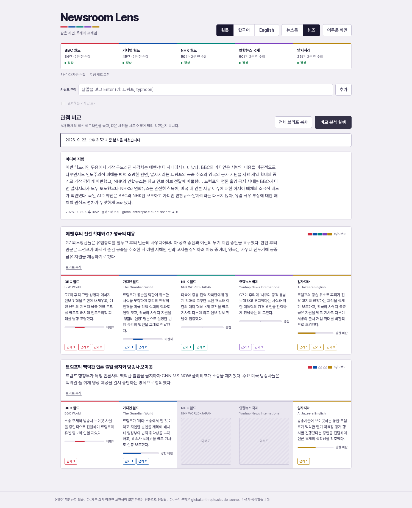
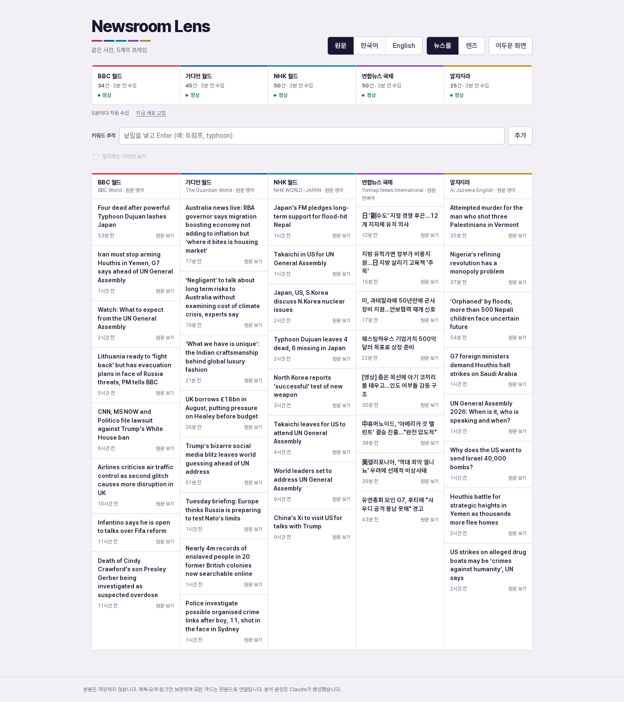
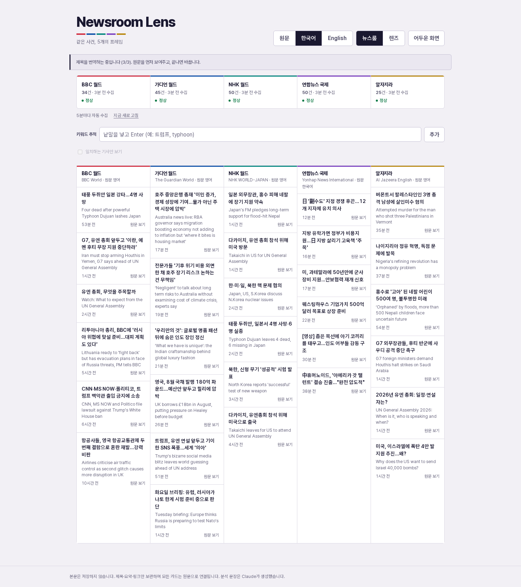
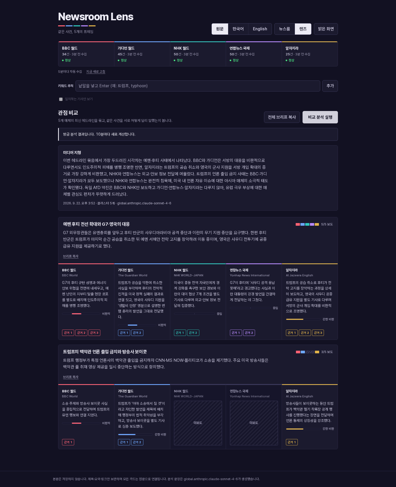

# Newsroom Lens

BBC · The Guardian · NHK WORLD-JAPAN · 연합뉴스 · Al Jazeera — 다섯 매체가 같은 세계를 어떻게 다르게 말하는지 비교한다.

**라이브:** https://df4knlft34smf.cloudfront.net/

이 도구가 답하려는 질문은 "무슨 일이 있었나" 가 아니라 **"누가 무엇을 말하지 않았나"** 다.
그래서 화면에서 가장 눈에 띄는 요소가 보도한 매체의 문장이 아니라 **비어 있는 채널**(`미보도`)이다.

### 렌즈 — 같은 사건, 다섯 개의 프레임

보도한 매체와 침묵한 매체가 **같은 폭**을 차지한다. 흐리게 처리하지 않고 측정 가능한 공백으로 둔다.
각 프레임은 원문 기사로 연결되는 근거 칩을 달고 있고, 근거가 없는 문장은 서버가 걸러 낸다.



### 뉴스룸 — 수집 현황



### 제목 이중 언어 — 원문을 지우지 않는다

`원문 / 한국어 / English` 를 전환한다. 번역을 볼 때도 **원문이 아래에 남는다** —
번역만 남으면 독자가 오역을 알아챌 방법이 없다. 연합뉴스(한국어 원문)는 반대 방향으로 동작한다.



<details>
<summary>어두운 화면</summary>



</details>

```
  브라우저 ──HTTPS──▶ CloudFront ──HTTP+X-Origin-Verify──▶ ALB ──▶ Fargate(:8000)
                                                            │         ├─ FastAPI (API + 정적 SPA)
                                                            │         ├─ 폴러 (5분 주기, 5개 피드)
                                                            │         └─ 인메모리 저장소 (매체별 50건)
                                                            │
                                     SG: CloudFront 프리픽스 리스트만 허용
                                                                      └──REST──▶ Bedrock Converse
```

---

## 빠르게 실행

```bash
cd backend
uv venv --python 3.11 && uv pip install -e '.[dev]'
set -a; source ~/capstone/.env; set +a          # AWS_BEARER_TOKEN_BEDROCK
.venv/bin/uvicorn app.main:app --port 8000
# → http://localhost:8000
```

```bash
cd backend && .venv/bin/python -m pytest -q     # 52 passed
```

컨테이너로:

```bash
docker build -f backend/Dockerfile -t newsroom-lens .   # 빌드 컨텍스트 = 저장소 루트
docker run -p 8000:8000 -e AWS_BEARER_TOKEN_BEDROCK="$AWS_BEARER_TOKEN_BEDROCK" newsroom-lens
```

## 배포

```bash
# 1) 토큰을 Secrets Manager 에 넣는다. CDK 는 이 값을 보지 않는다 (이름만 참조).
aws secretsmanager create-secret --name newsroom-lens/bedrock-bearer-token \
  --secret-string "$AWS_BEARER_TOKEN_BEDROCK" --region ap-northeast-2

# 2) 배포
cd infra && npm install
export CDK_DEFAULT_ACCOUNT=$(aws sts get-caller-identity --query Account --output text)
export CDK_DEFAULT_REGION=ap-northeast-2
npx cdk deploy
```

`infra/.origin-verify` 는 X-Origin-Verify 값을 보관한다(gitignore). 지우면 다음 배포에서 새 값이 생기고
CloudFront·ALB 양쪽이 함께 갱신된다.

---

## 데이터 소스

전부 API 키가 필요 없다. URL 은 `backend/app/config.py` 에 있고 **각 항목마다 실측 확인 날짜**가 붙어 있다.

| 매체 | 원문 | 형식 | 확인일 |
|---|---|---|---|
| BBC World | 영어 | RSS (`feeds.bbci.co.uk/news/world/rss.xml`) | 2026-09-22 · 200, 32건 |
| The Guardian World | 영어 | RSS (`theguardian.com/world/rss`) | 2026-09-22 · 200, 45건 |
| NHK WORLD-JAPAN | 영어 | **JSON** (`www3.nhk.or.jp/nhkworld/data/news/all.json`) | 2026-09-22 · 200, 574건 |
| 연합뉴스 국제 | 한국어 | RSS (`yna.co.kr/rss/international.xml`) | 2026-09-22 · 200, 120건 |
| Al Jazeera English | 영어 | RSS (`aljazeera.com/xml/rss/all.xml`) | 2026-09-22 · 200, 25건 |

**NHK 는 RSS 가 아니고, JSON 경로도 한 번 바뀌었다.** 여기서 두 번 틀렸다.

1. RSS 는 폐지됐다 — `en/news/rss/all.xml`·`rss.xml`·`feed.xml`·`atom.xml` 전부 404.
2. 처음 붙인 JSON 경로 `/nhkworld/data/en/news/all.json` 은 **버려진 낡은 인덱스**였다.
   지금도 HTTP 200 에 405건을 정상으로 돌려주지만 **2026-09-05 에 갱신이 멈췄다.**
   기사 URL 체계도 `/nhkworld/en/news/20260905_100/` → `/nhkworld/news/20260919de51188/` 로 바뀌었다.
   현재 살아 있는 경로는 `/nhkworld/data/news/all.json` 이고, 필드 구조가 같아 어댑터는 그대로 쓴다.

낡은 경로를 찾아낸 방법은 `robots.txt` 가 알려주는 사이트맵(`data/news/sitemap.xml`)이었다 —
거기에는 당일(20260922) 기사 URL 이 들어 있는데 우리가 읽던 인덱스에는 없었다.

> **이 사고가 남긴 교훈이 코드에 들어가 있다.** 얼어붙은 인덱스는 수집이 *매번 성공*하므로
> `last_error` 가 None 이고, 기사 수도 405건으로 넉넉하다. 그래서 헬스체크로는 영원히 '정상' 이다.
> 화면은 17일 전 기사를 아무 경고 없이 보여줬다. 죽은 소스는 눈에 보이지만 **얼어붙은 소스는
> 보이지 않는다.** 그래서 `SourceStatus` 에 '우리가 가져온 시각'(`last_success`)과 별개로
> **'매체가 쓴 시각'**(`newest_published`)을 기록하고, 최신 기사가 24시간보다 오래되면
> `stale=True` 로 내려 상태바에 `정체` 라고 띄운다. 실패(빨강)와 정상(초록) 사이의 제3의 상태다.

## API

| | |
|---|---|
| `GET /healthz` | 헬스체크. 피드가 다 죽어도 200 (재시작이 해결책이 아니므로) |
| `GET /api/articles?limit=20` | 매체별 최신 기사 + 매체 상태(건수·마지막 성공·실패 이유·정체 여부) |
| `POST /api/lens?refresh=false` | 클러스터링. 10분 버킷 캐시. Bedrock 실패 시 502 |
| `POST /api/titles?limit=20` | 제목의 한국어·영어 판본. 링크 키 영구 캐시. `failed` 건수를 함께 보고 |
| `POST /api/refresh` | '지금 새로 고침'. 자동 주기를 기다리지 않고 즉시 수집. 최소 60초 간격 |

### 번역은 언제 하나

수집할 때는 **번역하지 않는다.** 5분 폴러는 가져오기·정규화·저장만 한다.

1. 사용자가 `한국어` 또는 `English` 를 누르는 순간 `POST /api/titles` 가 나간다.
   `원문` 모드만 쓰는 방문자는 Bedrock 호출을 한 번도 일으키지 않는다.
2. 한 번에 다 하지 않고 **3단계(매체별 5 → 10 → 20건)** 로 넓혀가며 단계마다 다시 그린다.
   위쪽 카드가 약 30초에 먼저 한국어로 바뀌고 나머지가 채워진다.
3. **링크를 키로 영구 캐시**한다. 제목은 바뀌지 않으므로 기사당 한 번만 번역하면
   모든 방문자가 그 결과를 쓴다. 브라우저도 localStorage 에 한 벌 들고 있어
   새로 고침 직후에는 네트워크 없이 즉시 그린다.

단계를 나눈 이유는 토큰이 아니라 **시간**이다. `BATCH_SIZE=40` 일 때 묶음 한 번이 약 60초였고
**CloudFront 의 오리진 read timeout 이 정확히 60초**다 — 100건 요청이 실측 64초로 배포 환경에서
504 가 났다. 그래서 묶음을 20으로 줄이고 동시 호출을 3으로 묶었다. 현재 최악 단계가 37초다.

### 수집된 데이터는 어디 있나

**프로세스 메모리뿐이다. DB·디스크·S3 를 쓰지 않는다.**
`app/store/memory.py` 의 `dict[매체][link] → Article` 이 전부이고, 폴러(백그라운드)와
요청(핸들러)이 같이 만지므로 `threading.Lock` 으로 감싼다.

- **태스크를 재시작하면 전부 사라진다.** 한 주기면 다시 차므로 `/healthz` 는 저장소가 비어도 200 이다.
- **매체별 50건 상한.** 오래된 것부터 버려서 메모리가 무한히 자라지 않는다.
- **`link` 가 멱등 키**라 같은 기사를 다시 받아도 쌓이지 않고 덮어쓴다.
- **제목·링크·요약(300자)만 보관한다. 본문은 절대 저장하지 않는다** — 저작권 때문이고,
  모든 카드는 원문으로 링크한다.
- 렌즈 10분 버킷 캐시와 제목 번역 캐시도 같은 프로세스 메모리에 있다.

이 선택이 만드는 제약: **태스크가 하나일 때만 성립한다.** 그래서 Dockerfile 이 uvicorn 워커를
1개로 고정한다 — 워커나 태스크를 늘리면 각자 다른 기사 집합을 들게 되고, 근거 칩(`근거 1`)이
어느 워커에 붙었는지에 따라 다른 기사를 가리킬 수 있다. 수평 확장하려면 저장소를 프로세스
밖으로 먼저 빼야 한다.

### 수집 주기

자동 수집은 **5분 주기**다(`POLL_INTERVAL_SECONDS`). RSS 는 그보다 자주 바뀌지 않고, 매체 5곳을
2분마다 긁으면 얻는 것 없이 상대 서버에 부담만 준다.

'지금 새로 고침' 은 주기를 기다리지 않고 바로 긁지만 **최소 60초 간격**이다
(`MANUAL_REFRESH_MIN_SECONDS`). 제한은 **서버**에 있다 — 브라우저 쪽 제한은 새로 고침 한 번으로
사라지므로 외부 피드를 보호하지 못한다. 자동 폴과 수동 새로 고침이 같은 타이머를 공유하기 때문에,
자동 주기가 3초 전에 돌았다면 수동 요청은 긁지 않고 남은 시간만 알려준다.

제한에 걸린 요청도 **HTTP 200** 이다. 사용자는 아무것도 잘못하지 않았고 화면의 기사는 이미 최신이므로,
오류가 아니라 `{"refreshed": false, "retry_after_seconds": N}` 로 답한다.

## 설계에서 양보하지 않은 것

| 규칙 | 이유 |
|---|---|
| 단일 스키마로 정규화 | XML/JSON, RFC822/epoch 차이가 `normalize.py` 에서 전부 죽는다. 그래야 비교가 가능하다 |
| 매체별 실패 격리 | `gather(return_exceptions=True)` + 매체별 상태. 한 피드가 죽어도 셋은 갱신된다 |
| 실패해도 기존 기사 유지 | 수집 실패는 화면을 비우는 사건이 아니다. 실패 이유만 컬럼에 적는다 |
| link 가 멱등 키 | 같은 기사를 다시 받아도 쌓이지 않는다. 매체별 50건 상한, 오래된 것부터 버린다 |
| 본문 미저장 | 제목·요약(300자)·링크만. 모든 카드가 원문으로 나간다 |
| 근거 없는 프레임은 버린다 | 모델이 인용한 인덱스를 검증하고, 범위를 벗어나면 그 매체를 `미보도` 로 내린다 |
| 2개 매체 미만 클러스터 폐기 | 비교가 성립하지 않는 카드는 화면에 올리지 않는다 |
| 침묵을 표시한다 | `미보도` 는 흐린 글씨가 아니라 보도한 채널과 **같은 폭의 빈 채널**이다 |
| 토큰은 런타임에만 | 이미지·템플릿·저장소 어디에도 없다. ECS Secrets 주입뿐 |

## 추가 기능

| | |
|---|---|
| **5번째 소스** | Al Jazeera. 열 수·트랙·채널·색이 전부 `/api/articles` 응답에서 나오므로 `FEEDS` 한 곳만 고치면 UI 가 따라온다 (프런트엔드에 매체 목록이 하드코딩되어 있지 않다) |
| **제목 이중 언어** | 원문 / 한국어 / English 전환. 번역을 볼 때 **원문을 항상 아래에 남긴다** — 번역만 남으면 독자가 오역을 알아챌 방법이 없다 |
| **키워드 추적** | 낱말을 고정하면 제목·요약·프레임에서 강조되고, 토글로 걸러낸다. 일치 판정은 원문·한국어·영어 제목 **전부**에서 본다 (한국어 화면에서 `trump` 가 안 잡히면 추적이 거짓이 된다) |
| **논조 막대** | 프레임별 −2~+2. '좋은 뉴스'가 아니라 **행위 주체에 대한 비판 강도**다. 서버가 범위를 좁혀서 내보낸다 |
| **브리프 복사** | 클러스터별·전체 평문 내보내기. 근거 링크를 반드시 포함한다 — 링크를 빼면 Slack 에 검증 불가능한 주장만 남는다 |
| **오프라인 폴백** | 마지막 성공 응답을 localStorage 에 남겨 서버에 닿지 못할 때 보여준다. 분석 버튼은 잠근다 |

## 실측으로 바로잡은 값

스펙 초안과 다르게 간 곳. 전부 코드 주석에 근거를 남겼다.

- **`maxTokens` 1500 → 5000.** 매체 4곳·tone 없음에서 출력이 2,233 토큰, 매체 5곳·tone 포함에서
  2,895 토큰이었다. 1500 에서는 `stopReason=max_tokens` 로 JSON 이 잘려 파싱 자체가 불가능했다.
- **매체별 입력 12건 → 25건.** 연합뉴스는 피드에 120건을 싣고 BBC 는 32건이다. 같은 "최신 12건" 을
  자르면 연합뉴스 창은 1시간치·BBC 창은 하루치가 되어 교집합이 구조적으로 사라진다. 그러면 유일한
  한국어 매체가 늘 `미보도` 로 밀리는데, 그때의 `미보도` 는 침묵이 아니라 **창 크기가 만든 거짓말**이다.

## 잡은 버그 세 개

셋 다 조용히 틀리는 종류였다 — 에러를 내지 않고 그럴듯한 화면을 보여준다.

**1. `\'` 하나가 40건을 날렸다.** 모델이 한국어 제목의 아포스트로피를 자바스크립트 습관대로
`\'` 로 이스케이프한다(`"전 \'암살단\' 지도자"`). JSON 표준에는 `\'` 가 없어서 `json.loads` 가
문서 **전체**를 거부하고, 제목 40개 묶음이 통째로 버려졌다. `repair_json_escapes()` 로 고친다.
**같은 파서를 `/api/lens` 도 쓴다** — 한국어 프레임이 영어 표현을 인용하면(`'Trump TV'`) 같은 경로를
밟으므로, 렌즈도 아포스트로피 하나 거리에서 502 를 낼 수 있었다.

**2. 원문의 따옴표를 그대로 베끼게 만들었다.** 연합뉴스 제목에는 ASCII 큰따옴표가 흔하다
(`IMF "스리랑카 … 아시아 최고"`). "이미 해당 언어면 그대로 옮겨라" 라는 규칙 때문에 모델이 이걸
JSON 문자열에 이스케이프 없이 복사해 문서를 깨뜨렸다 — 제목 **하나만** 넘겨도 깨지므로 분할
재시도로도 복구되지 않았다. 해결: **이미 가진 언어는 모델에게 부탁하지 않는다.** 원문 쪽은 로컬에서
원문 그대로 채우고 반대쪽 한 언어만 생성한다. 출력 토큰도 절반이 된다. 그래도 깨지면 JSON 을
포기하고 평문 한 줄로 받는다(이스케이프가 원리적으로 불가능한 경로). 100건 중 실패 0건.

**3. `e.currentTarget` 은 `await` 뒤에 null 이다.** 이벤트 디스패치가 끝나면 브라우저가 비우고,
async 핸들러의 `await` 뒤 코드는 이미 다음 마이크로태스크다. `await` 하기 전에 붙잡아야 한다.

## 오리진 보호

ALB 를 두 겹으로 막는다. 한 겹만으로는 부족하다.

1. **보안 그룹** — CloudFront 관리형 프리픽스 리스트(`com.amazonaws.global.cloudfront.origin-facing`,
   조회해서 쓴다)에서 오는 80 만 허용. 인터넷에서 ALB DNS 를 직접 때리는 경로를 TCP 단계에서 끊는다.
2. **X-Origin-Verify 헤더** — 값이 틀리면 리스너 기본 동작이 403. 프리픽스 리스트는 *모든* CloudFront 를
   허용하므로, 남의 배포를 경유하는 경로는 1) 로는 막히지 않는다.

`alb.addListener()` 의 **`open: false` 가 필수**다. 기본값 `true` 는 보안 그룹에 `0.0.0.0/0` 인그레스를
조용히 추가하고, 그러면 1) 의 규칙이 나란히 남아 있으면서도 아무 의미가 없어진다. 코드만 봐서는 보이지
않으니 합성된 템플릿의 `SecurityGroupIngress` 를 직접 확인해야 한다.

검증(2026-09-22):

```
CloudFront  /, /styles.css, /app.js, /api/articles, /healthz  → 200
ALB 직접    헤더 없음 / 틀린 헤더                              → 연결 불가 (SG 가 TCP 차단)
ALB 설정    SG 인그레스 = pl-22a6434b 만 (IpRanges 0개)
            리스너 기본 = 403, priority 10 = X-Origin-Verify 일치 시 forward
```

## 구조

```
backend/app/
  config.py            피드 정의(+확인일) · 런타임 설정
  collector/
    normalize.py       HTML 제거 · 300자 컷 · 날짜 파싱 · RSS/JSON 어댑터
    feeds.py           가져오기 + 파싱. 실패는 전부 FeedError 로 좁힌다
    poller.py          120초 루프. 매체별 격리. 루프는 죽지 않는다
  store/
    models.py          Article · SourceStatus(정체 감지 포함)
    memory.py          link 멱등 · 매체별 50건 상한 · 스레드 락
  llm/
    prompts.py         JSON 계약 + 인덱스 인용 + 언어 교차 매칭 (FEEDS 에서 생성)
    bedrock.py         Converse REST(Bearer) + 방어적 JSON 파싱 + 이스케이프 수리
    lens.py            검증 · 10분 버킷 캐시 · 근거 인덱스→링크 해석 · 논조 범위 제한
    translate.py       제목 이중 언어 · 링크 키 영구 캐시 · 분할 재시도 · 평문 폴백
  api/routes.py        /healthz · /api/articles · /api/lens · /api/titles
frontend/              index.html · styles.css · app.js (빌드 단계 없음)
infra/                 CDK: CloudFront → ALB → Fargate
tools/shoot.mjs        스크린샷 (arm64 에 Chrome 이 없어 Chromium 을 직접 띄운다)
tools/interact.mjs     키워드·필터·브리프 복사 상호작용 검증
```
