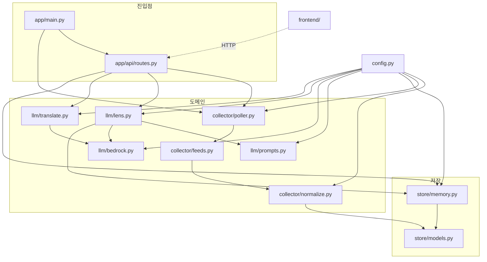
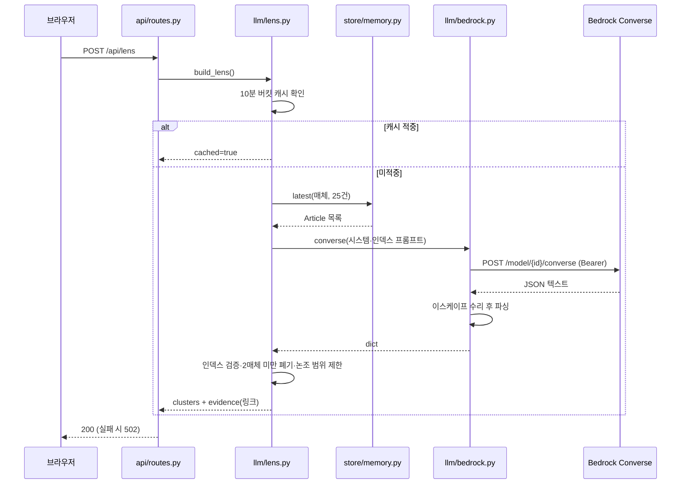

# newsroom-lens 아키텍처

## 1. 개요
- 한 줄 요약: 국제 뉴스 매체 5곳의 헤드라인을 주기 수집해 같은 사건의 매체별 프레임 차이를 LLM으로 비교하는 단일 컨테이너 웹앱.
- 스택: Python 3.11 / FastAPI + uvicorn(단일 워커) / 정적 SPA(빌드 없음) / AWS CDK(TypeScript)
- 진입점: `backend/app/main.py` (`uvicorn app.main:app`). 인프라는 `infra/bin/newsroom-lens.ts`.

## 2. 구성 요소
| 경로 | 역할 | 의존 대상 |
|---|---|---|
| `app/main.py` | FastAPI 앱, 라우터 등록, 정적 SPA 마운트, lifespan에서 폴러 태스크 기동 | `api`, `collector` |
| `app/api/routes.py` | 5개 엔드포인트. `LensError`를 502로 변환 | `collector`, `llm`, `store`, `config` |
| `app/config.py` | `FeedSpec` 5건(검증 날짜 포함)과 `Settings`. 단일 설정 출처 | 없음 |
| `app/collector/feeds.py` | HTTP 취득 + 종류별 파싱. 실패를 `FeedError`로 좁힘 | `normalize`, `config`, `store.models` |
| `app/collector/normalize.py` | RSS/JSON 두 어댑터를 `Article` 하나로 접는 경계 | `config`, `store.models` |
| `app/collector/poller.py` | 주기 루프 + 수동 새로 고침 속도 제한 | `feeds`, `store`, `config` |
| `app/store/models.py` | `Article`, `SourceStatus`(정체 판정 포함) | 없음 |
| `app/store/memory.py` | 인메모리 저장소. `link` 멱등, 매체별 상한, 스레드 락 | `models`, `config` |
| `app/llm/bedrock.py` | Bedrock Converse REST 호출 + 방어적 JSON 파싱 | `config` |
| `app/llm/prompts.py` | `FEEDS`에서 시스템 프롬프트 생성 | `config`, `store.models` |
| `app/llm/lens.py` | 클러스터 검증, 10분 버킷 캐시, 인덱스→링크 해석 | `bedrock`, `prompts`, `store` |
| `app/llm/translate.py` | 제목 이중 언어화. 링크 키 캐시, 분할 재시도, 평문 폴백 | `bedrock`, `config`, `store.models` |
| `frontend/` | `index.html`·`app.js`·`styles.css`. 매체 목록을 하드코딩하지 않음 | 위 API |
| `infra/lib/newsroom-lens-stack.ts` | VPC·Fargate·ALB·CloudFront·Secrets 참조 | `bin/newsroom-lens.ts` |

## 3. 구조 도면

순환 의존 없음. `config`와 `store/models`가 말단이고 모든 의존이 진입점 → 도메인 → 저장 방향이다.
`routes`가 `collector`를 직접 부르는 경로는 수동 새로 고침 하나뿐이다.

## 4. 핵심 흐름

## 5. 데이터와 외부 의존
- **저장소 없음.** DB·디스크를 쓰지 않는다. `store/memory.py`의 `dict[매체][link]`가 전부이며 태스크 재시작 시 소멸한다. 렌즈 버킷 캐시와 제목 번역 캐시도 같은 프로세스 메모리에 있다. 본문은 저장하지 않고 제목·링크·요약만 보관한다.
- **외부 취득**: `feeds.bbci.co.uk`, `www.theguardian.com`, `www3.nhk.or.jp`(JSON), `www.yna.co.kr`, `www.aljazeera.com`
- **외부 생성**: `bedrock-runtime.{region}.amazonaws.com` Converse REST (SDK 미사용, Bearer 토큰)
- **환경변수 키**: `AWS_BEARER_TOKEN_BEDROCK`, `BEDROCK_REGION`, `BEDROCK_MODEL_ID`, `BEDROCK_MAX_TOKENS`, `POLL_INTERVAL_SECONDS`, `MANUAL_REFRESH_MIN_SECONDS`, `MAX_ARTICLES_PER_SOURCE`, `SUMMARY_MAX_CHARS`, `LENS_CACHE_BUCKET_SECONDS`, `LENS_HEADLINES_PER_SOURCE`, `LOG_LEVEL`, `FRONTEND_DIR`
- **인프라 측 키**: `ORIGIN_VERIFY_TOKEN`, `BEDROCK_SECRET_NAME`, `CDK_DEFAULT_ACCOUNT`, `CDK_DEFAULT_REGION`
- **배포**: CloudFront → ALB(프리픽스 리스트 SG + `X-Origin-Verify`) → Fargate(ARM64). 토큰은 Secrets Manager에서 런타임 주입.

## 6. 확인 필요
- 없음.
